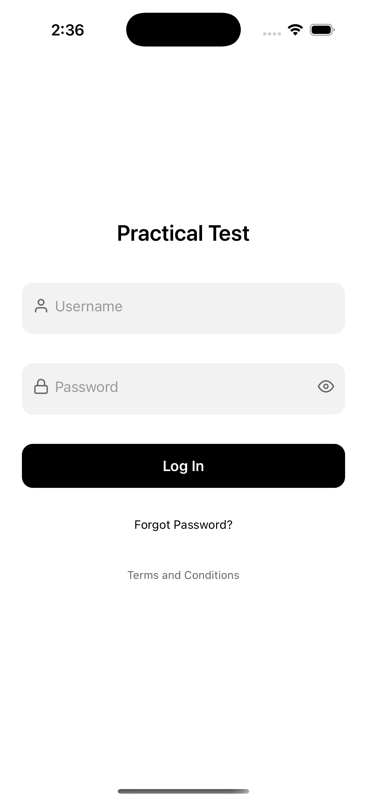
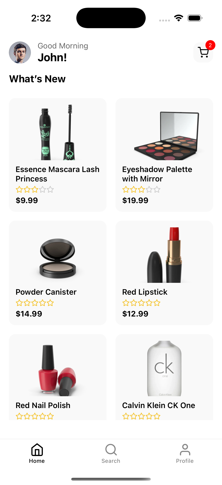
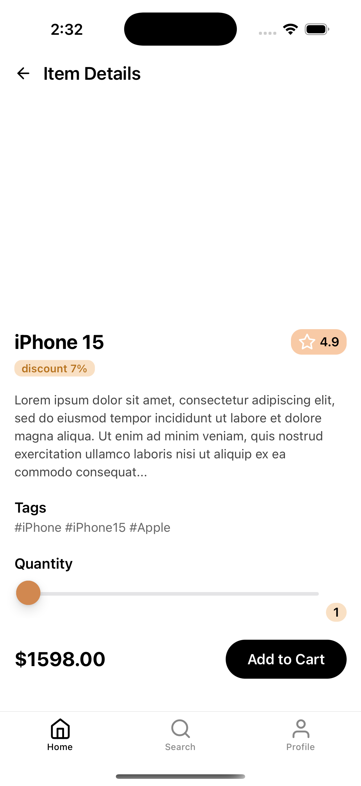
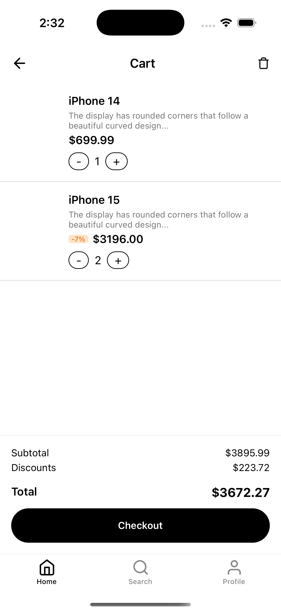
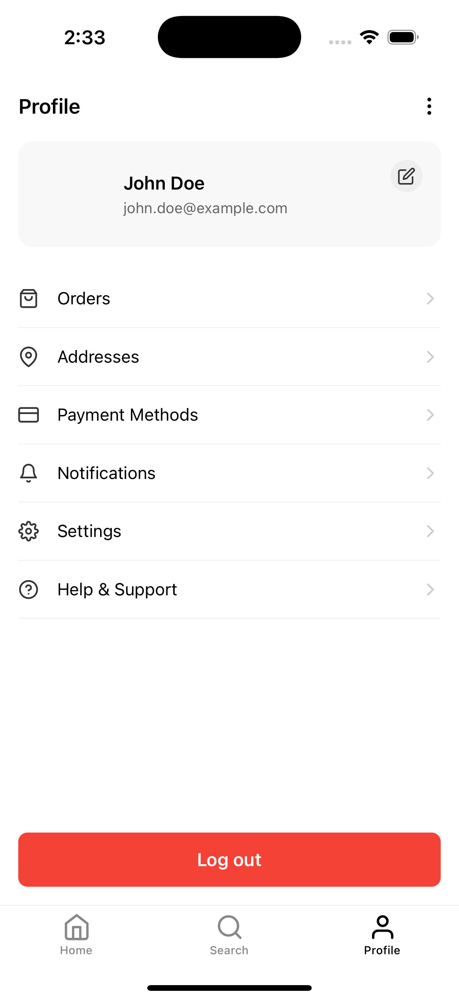
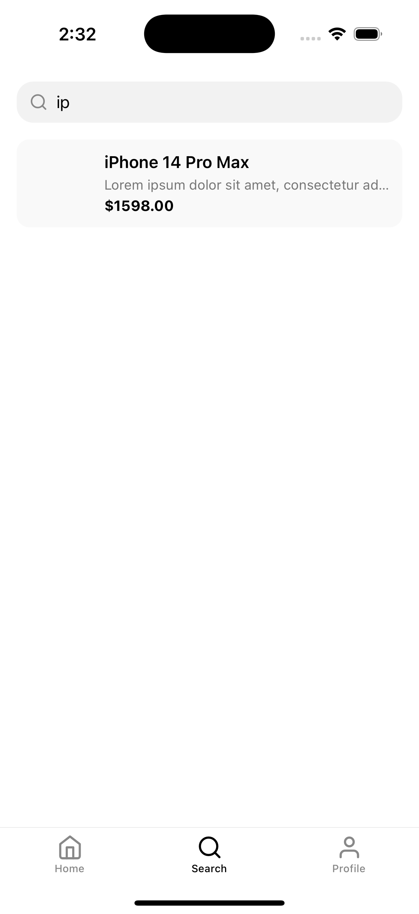
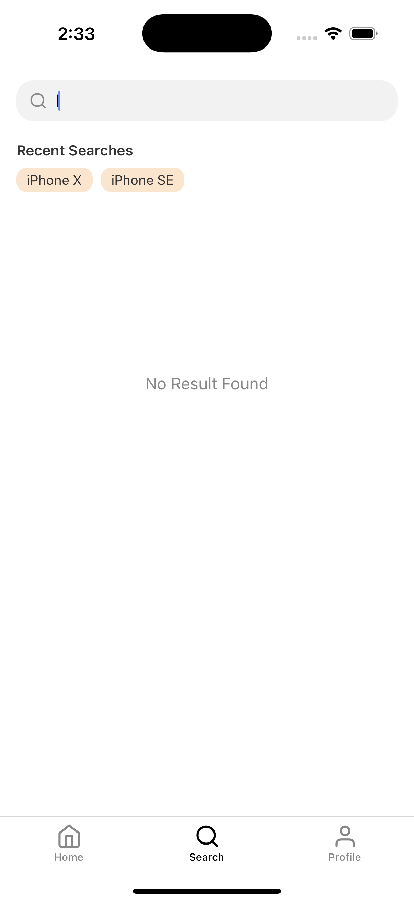

# TechCart 🛒 — React Native Practical Assessment

A simple, modern e-commerce mobile app built with **React Native 0.80.1**, demonstrating state management, side effects, navigation, form validation, and modular architecture.

This project was created as a practical assessment and uses real APIs to showcase user authentication, product listing, detail viewing, and cart handling.

---

## 🔧 Tech Stack & Features

| Feature         | Description |
|----------------|-------------|
| **React Native** | Version 0.78.2 |
| **Redux Toolkit** | Global state management |
| **Redux-Saga** | Handling async logic (API calls, session restore, etc.) |
| **React Navigation** | Stack and bottom tab navigators |
| **MMKV Encrypted Storage** | Secure token persistence |
| **Axios** | Typed HTTP client with retry support |
| **react-hook-form** | Elegant form handling and validation |
| **Reusable UI Components** | Buttons, Inputs, ProductCards, Error & Loading screens |
| **API Integration** | Uses `https://dummyjson.com` for products and auth |

---

## 📱 Screenshots

### Login Screen


### Home Screen


### Product Details


### Cart 


### Profile 


### Search 


### Recent Search 


---

## Getting Started

> **Note**: Make sure you have completed the [Set Up Your Environment](https://reactnative.dev/docs/set-up-your-environment) guide before proceeding.

### Step 1: Start Metro

```sh
# Using npm
npm start

# OR using Yarn
yarn start
